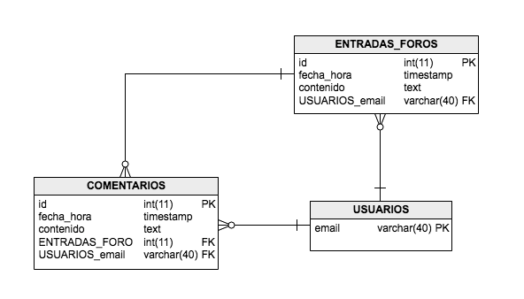
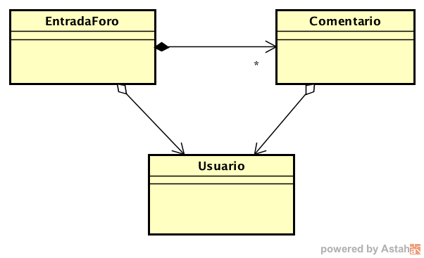

## Escuela Colombiana de Ingeniería

### PDSW – Procesos de desarrollo de Software
### Parcial Segundo Tercio


**IMPORTANTE**

* Trabajar en Linux (para evitar problemas con las instrucciones finales).
* Se puede consultar en la Web: APIs/Documentación de lenguaje y frameworks (Primefaces, Guice, MyBatis, etc), y enunciados de los laboratorios (se pueden revisar los fuentes incluidos con los dichos enunciados).
* No se permite: Usar memorias USB, acceder a redes sociales, clientes de correo, o sistemas de almacenamiento en la nube (Google Drive, DropBox, etc). El uso de éstos implicará anulación.
* Clone el proyecto con GIT, NO lo descargue directamente.
* NO modifique los indicado en consultaEntradasForos.xhtml.
* El filtrado y ordenamiento de los datos DEBE realizarse en el motor de base de datos, a través del uso de SQL. Consultar todos los datos y filtrarlos en el servidor de aplicaciones -que es supremamente INEFICIENTE- se evaluará como INCORRECTO.


Se le han dado los fuentes de un avance parcial de una plataforma de foros en línea. En esta plataforma los usuarios podrán plantear preguntas (entrada foro), y éstos mismos podrán registrar comentarios sobre las mismas.

Para el Sprint en curso, se han seleccionado las siguientes historias de usuario del Backlog de producto:

## Historia de usuario #1

  -------------------------------------------------------------------------------------------------------------------------------------------------------------------------------------
  > **Como** Usuario de la plataforma de foros
  >
  > **Quiero** Poder consultar un foro a partir de su identificador.
  >
  > **Para** Poder hacer una revisión de los comentarios realizados a un foro cuyo identificador ya conozco, y así evitar la búsqueda del mismo.
  >
  > **Criterio de aceptación:** Se debe mostrar la fecha de creación de la entrada de foro, la pregunta planteada, y cada uno de los comentarios realizados. Los comentarios deben estar organizados del más reciente (mostrados arriba) al más antíguo, y deben mostrar la fecha, el nombre del autor, y el contenido.

## Historia de usuario #2

  -------------------------------------------------------------------------------------------------------------------------------------------------------------------------------------
  > **Como** Auditor de contenidos de la plataforma
  >
  > **Quiero** Tener un reporte de aquellos foros en los que se haya realizado algún comentario con lenguaje vulgar.
  >
  > **Para** Conocer con rapidez qué foros debo revisar y tomar medidas al respecto.
  >
  > **Criterio de aceptación:** El reporte NO debe requerir entrar parámetro alguno. Se considerarán como palabras vulgares: 'recorcholis' y 'carambolas'. El reporte sólo debe contener el identificador de foro y el número de comentarios con palabras vulgares encontrados en el mismo.
  -------------------------------------------------------------------------------------------------------------------------------------------------------------------------------------

El modelo de base de datos y de clases asociados a la implementación parcial son los siguientes:




A partir de la aplicación base suministrada, debe realizar lo siguiente:


Dado un identificador de entrada foro ingresado, mostrar el enunciado del mismo y los comentarios realizados

Mostrar los foros que contengan entradas con malas palabras: carambolas y recorcholis


1.  (20%) A partir de la especificación hecha en los métodos
    *consultarForosPorId* y *consultarForosConVulgaridades* de la fachada de
    servicios (la parte lógica de la aplicación), implemente sólo una prueba (la que considere más importante para validar las especificaciones y los criterios de aceptación). Siga el esquema usado en ServicesJUnitTest para poblar la base de datos volátil y verificar el comportamiento de las operaciones de la lógica.

2.  (40%) Implemente la historia de usuario #1, agregando todo lo que haga falta en la capa de presentación, lógica y de persistencia. La vista debe implementarse en consultaEntradasForo.xhtml.

3.  (40%)Implemente la historia de usuario #2, agregando todo lo que haga falta en la capa de presentación, lógica y de persistencia. La vista debe implementarse en consultarForosADepurar.xhtml.


## Entrega

Siga al pie de la letra estas indicaciones para la entrega del examen. EL HACER CASO OMISO DE ESTAS INSTRUCCIONES PENALIZARÁ LA NOTA.

1. Limpie el proyecto

	```bash
	$ mvn clean
	```

1. Configure su usuario de GIT

	```bash
	$ git config --global user.name "Juan Perez"
	$ git config --global user.email juan.perez@escuelaing.edu.co
	```

2. Desde el directorio raíz (donde está este archivo README.md), haga commit de lo realizado.

	```bash
	$ git add .
	$ git commit -m "entrega parcial - Juan Perez"
	```


3. Desde este mismo directorio, comprima todo con: (no olvide el punto al final en la segunda instrucción)

	```bash
	$ zip -r APELLIDO.NOMBRE.zip .
	```

4. Abra el archivo ZIP creado, y rectifique que contenga lo desarrollado.

5. Suba el archivo antes creado (APELLIDO.NOMBRE.zip) en el espacio de moodle correspondiente.

6. IMPORTANTE!. Conserve una copia de la carpeta y del archivo .ZIP.
